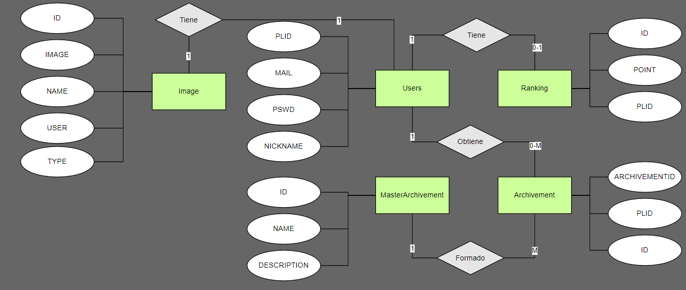
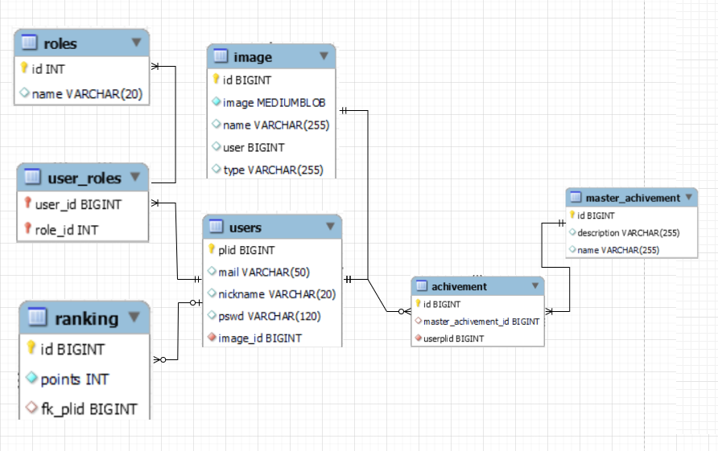
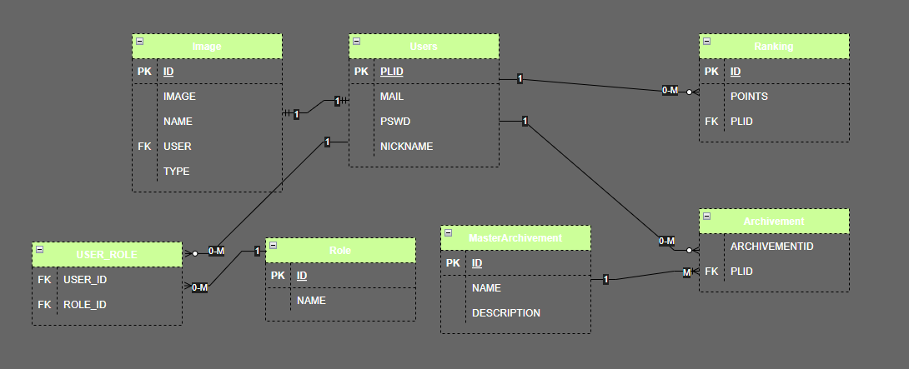
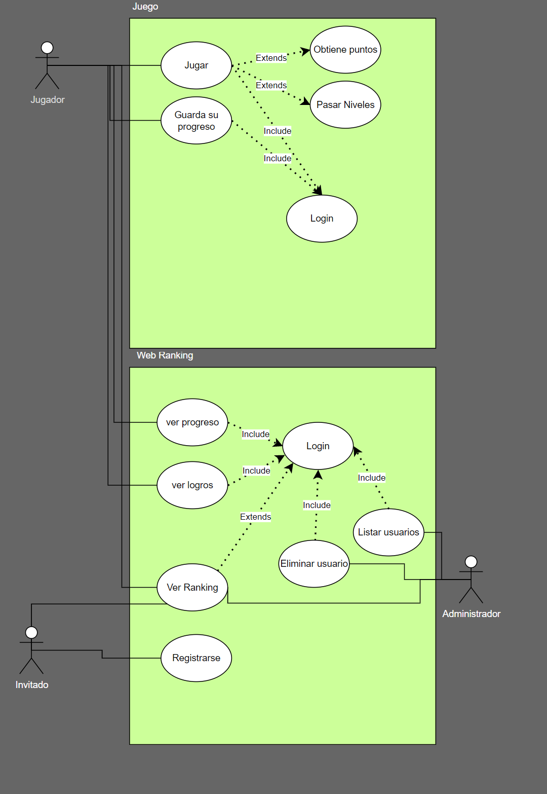
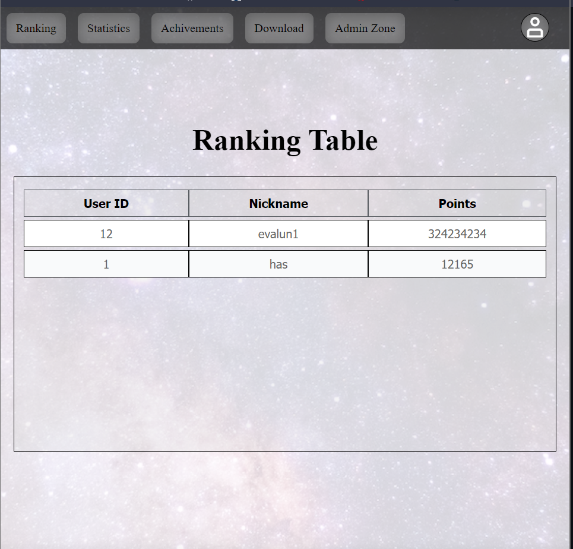
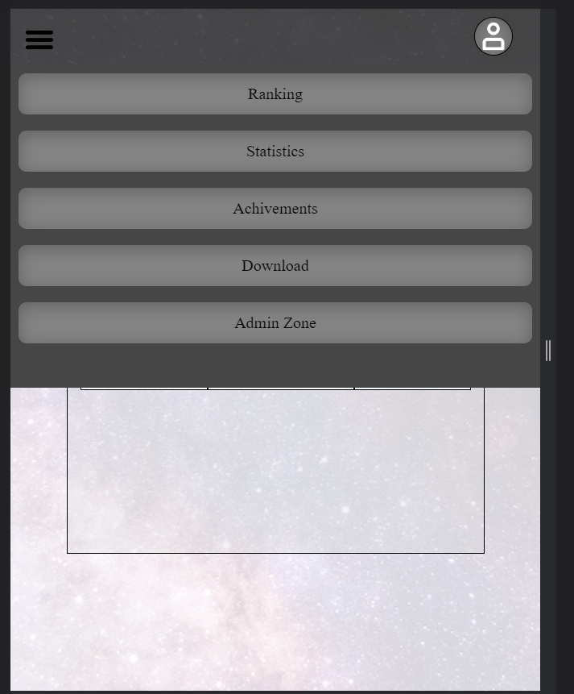
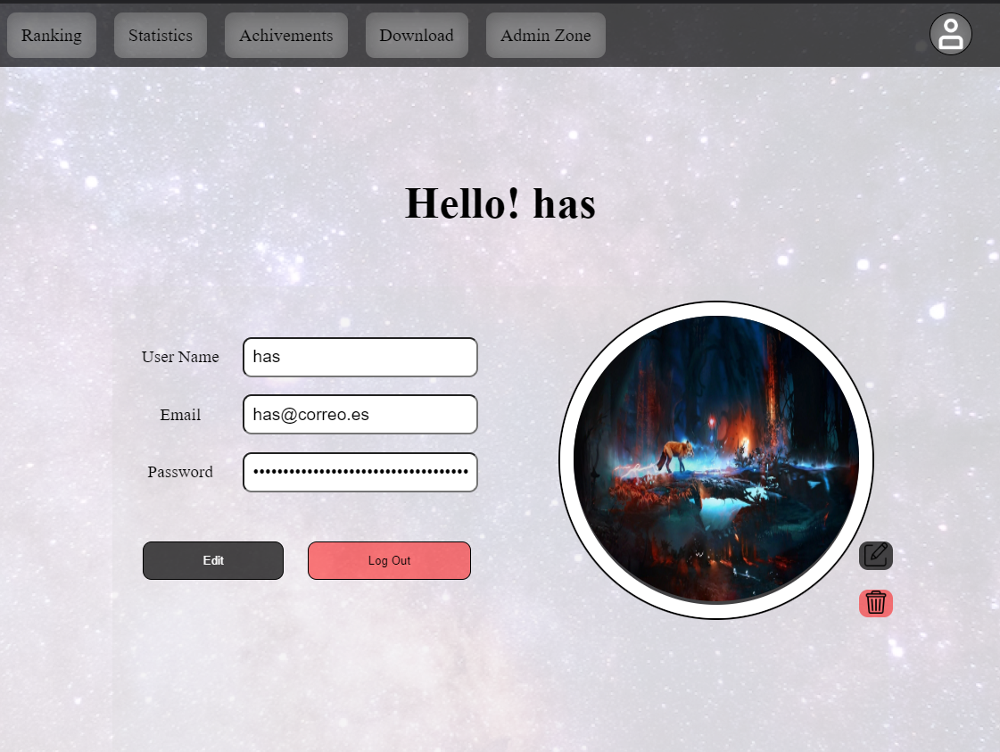
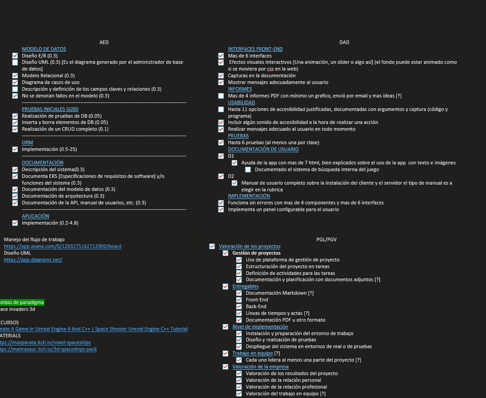
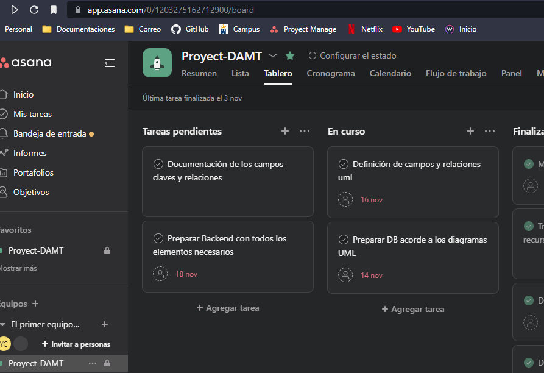

<div align="center">
    

  <h3 align="center">SpaceWar FullStack Game</h3>

  [](https://github.com/yassirH9)

</div>
<details>
  <summary>Documentation Index</summary>
    <ol>

- [Ababout the project](#Ababout-the-project)
- [Installation manual](#Installation-manual)
- [Data Model diagram](#Data-Model-diagram)
    - [Data Diagram](#Data-Diagram)
    - [Basic explanation of the data model](#Basic-explanation-of-the-data-model)
    - [Relationship of entities](#Relationship-of-entities)
- [Use case diagram](#Use-case-diagram)
- [Technical requirements](#Technical-requirements)
- [Interface](#Interface)
  - [First design idea](#First-design-idea)
  - [Accessibility and usability documentation](#Accessibility-and-usability-documentation)
- [User requirements](#User-requirements)
- [Technology stack](#Technology-stack)
- [Technology selection](#Technology-selection)
- [Type of aprication](#Type-of-application)
- [Planification](#Planification)
- [Project conclusion](#Project-conclusion)
- [External links](#External-links)

    </ol>
</details>

## Ababout the project

<p style="text-align:justify;">
This project consists of a full stack application to visualize game data, such as achievements, scores and rankings. The application is developed using Angular on the front-end and Spring Boot on the back-end, and Unreal Engine has been used to create the game.

The web admin panel is designed to be user-friendly and provides an intuitive interface for users to access the game data easily. With it, users can view the scores and achievements of each player, as well as the ranking of all players.

As for the gameplay, it is expected to be a space invaders style game with solid mechanics and a system of online rankings and achievements which can be managed on the web and encourage the player to beat their records as much as possible.

In summary, this full stack application is a complete solution to visualize and manage game data using Angular, Spring Boot and Unreal Engine.
</p>

## Installation manual

1. Clone the repository

    * Clone the project
        ```sh
        git clone https://github.com/yassirH9/SpaceWar.git
        ```
    
2. Web server startup

    * Install node module
        ```sh
        npm install
        ```
    * Start web server
        ```sh
        npm start
        ```
        if you want to modify the npm start command the base command is in package.json
    <br>
    * Alternative way to start the web server
        ```sh
        ng serve --proxy-config ./src/proxy.conf.json
        ```
    <br>
3. Backend startup
        3.1. Import the SpaceWarBackend folder into a java IDE.
        3.2. Open the application.properties and follow these steps.
        
    * Create a connection in the database in this case MySQL and without creating any element add the connection data in the following lines substituting the example data.
        ```sh
        spring.datasource.url = jdbc:mysql://localhost/example_db_url?useSSL=true
        spring.datasource.username = example_db_user
        spring.datasource.password = example_db_password
        ```
    *  The backend will create all the necessary content for the database, for this you have to uncomment the following line.
        ```sh
        spring.jpa.hibernate.ddl-auto = create
        ```
        <font color="red">*WARNING: </font> After the first execution of the backend comment the previous line again or else if the server is restarted all the data in the database will be deleted and all the entities will be created again.
4. Swagger
    4.1. Yo access swagger use the following [URL](http://localhost:8080/swagger-ui/) with the backend working
    4.2 In the documentation browser use the following address to view the end-point documentation
    ```
    /v2/api-docs
    ```
## Data Model diagram

##### Data model
<p align="center">
  
</p>

As can be seen in the previous diagram, the initial model consists of 4 main entities and later a new entity was added for the user images.

#### Basic explanation of the data model
In this section I will make a short explanation of each entity and its attributes.
        <div style="margin-left:55px;">
            <strong style="color:#c1dbc3; margin-left:-30px;">User:</strong>
       <strong style="font-size:15px;" >PLID:</strong> User identifier used for searches in the backend and for searches in other related entities.
        <strong style="font-size:15px;" >MAIL:</strong> User email address, it could be used to verify user accounts and avoid bots.
        <strong style="font-size:15px;" >PSWD:</strong> User password encrypted with bcript.
        <strong style="font-size:15px;" >NICKNAME:</strong> Username, this is used to log-in to the web site
        </div>
        <hr>
        <div style="margin-left:55px;">
            <strong style="color:#c1dbc3; margin-left:-30px;">Ranking:</strong>
        <strong style="font-size:15px;" >ID:</strong> Identifier for modifications and other actions.
        <strong style="font-size:15px;" >POINT:</strong> Number of points obtained by the user in the game.
        <strong style="font-size:15px;" >PLID:</strong> User identifier to establish the relationship.
        </div>
        <hr>
        <div style="margin-left:55px;">
            <strong style="color:#c1dbc3; margin-left:-30px;">Achivement:</strong>
        <strong style="font-size:15px;" >ID:</strong> Identifier for modifications and other actions.
        <strong style="font-size:15px;" >PLID:</strong> User identifier to establish the relationship.
        <strong style="font-size:15px;" >ACHIVEMENTID:</strong> Achivement master identifier for establishing the relationship.
        </div>
        <hr>
        <div style="margin-left:55px;">
            <strong style="color:#c1dbc3; margin-left:-30px;">Master Achivement:</strong>
        <strong style="font-size:15px;" >ID:</strong> Relationship identifier as master.
        <strong style="font-size:15px;" >NAME:</strong> This will be used to assign a name to an internal achievement in the game.
        <strong style="font-size:15px;" >DESCRIPTION:</strong> Small description of the achievement that will be displayed on the website after obtaining the achievement in the game.
        </div>
        <hr>
        <div style="margin-left:55px;">
            <strong style="color:#c1dbc3; margin-left:-30px;">Image:</strong>
        <strong style="font-size:15px;" >ID:</strong> Used internally by the backend to establish a relationship with the user.
        <strong style="font-size:15px;" >IMAGE:</strong> MEDIUMBLOB with image.
        <strong style="font-size:15px;" >NAME:</strong> name generated automatically and hashed by the backend to avoid repetition.
        <strong style="font-size:15px;" >USER:</strong> User id to establish relationship.
        <strong style="font-size:15px;" >TYPE:</strong> Yype of image uploaded png, jpg etc.
        <br >
        In this case as I only store one photo per user I decided to save these in the database, it is like that since it is not required to program a file search system in the backend and the hibernate understands it as an entity which can have a relationship that in this case is with the user.
        </div>
        <hr>
        <div style="margin-left:55px;">
            <strong style="color:#c1dbc3; margin-left:-30px;">Roles:</strong>
        <strong style="font-size:15px;" >ID:</strong> Role master identifier.
        <strong style="font-size:15px;" >NAME:</strong> Name assigned to identify the role on the front-end.
        </div>
        <hr>
        <div style="margin-left:55px;">
            <strong style="color:#c1dbc3; margin-left:-30px;">User_Role:</strong>
        <strong style="font-size:15px;" >USER_ID:</strong> User identifier to establish the relationship with the role master.
        <strong style="font-size:15px;" >ROLE_ID:</strong> Role identifier to establish the relationship with the user.
        </div>
        All entities are automatically generated by the backend if the instructions have been followed correctly.

#### Relationship of entities

<div>

```
USER - RANKING : OneToOne : A user can have either 0 or 1 ranking position.
```
```
USER - ACHIVEMENT : OneToMany : A user can have 0 to many achivement, this is the intermediate table of the relationship between user and masterachivement making this an M-M relationship.
```
```
USER - IMAGE: OneToOne : OneToOne : A user can have 0 or 1 photo and a photo can only have one user in its relationship.
```
```
ACHIVEMENT - MASTERACHIVEMENT : OneToMany : A master achivement can have many achivements and an achivement can only have one master achivement.
```
</div>

#### Extra diagrams
<div align="center">
    
##### UML

</div>
<div align="center">
    
##### Relational

</div>

## Use case diagram

<div align="center">

</div>
<br>
<p style="text-align: justify;">
In the following use case you can see three main roles with their functions and requirements, a guest which can access the general ranking of the game, this is visible on the web and does not require login, also can be registered as a new user as it will be necessary to download the game, the next role is the user, this has access to everything needed to view your saved data and modify them to taste except the data generated by the game, finally an administrator who has absolute control of the data of the web and registered users.
</p>

## Technical requirements
#### BackEnd
- RAM: Minimum 3GB free ram.
- ROM: 1GB free space.
- CPU: I5 or derivatives thereafter.
- GPU: N/A
- Other requirements
    - MySQL or SQL-derived servers.
    - IntelliJ or Eclipse to run backend
#### FrontEnd
- Visual Studio code to run a front-End web server
- Web Browser [Chrome, Brave or derived].
    - This web application is optimized for mobile devices.
## Interface
#### First design idea
[Link to see mockups and design in figma.](https://www.figma.com/file/2MKemHpBx1IHK3T7tlcxpN/Untitled?node-id=0%3A1&t=l5M5d8fELxULJaG3-1)

#### Accessibility and usability documentation

#### Usability

<p style="text-align: justify;">
in terms of usability all the elements and components that make up the web should follow a scheme of contrasts, it is intended that all elements are legible and striking, without sacrificing usability for this I have followed the following rules.
</p>

- A minimalist design with only the necessary controls and well highlighted so that the user does not get lost in the navigation of the web.
- Warning or feedback for non-return actions such as deleting or modifying elements.
- The use of moderate animations to keep the user's attention on the main sections of the website such as the ranking-table.
- Other aspects of the design according to usability is the responsive menu, which is designed with colors that do not make it unreadable to change size by standardizing the use of neutral colors and font sizes readable for mobile devices.

User interface examples

<div align="center">

#### Desktop menu

</div>

<div align="center">

#### Movile menu

</div>

<div align="center">

#### User Edit example

</div>

#### Color palette
- Menu
    - rgba(0, 0, 0, 0.678);
    - rgba(217, 217, 217, 0.418);
- Buttons
    - rgba(255, 0, 0, 0.5);
    - rgba(0, 0, 0, 0.7);

We try that all the colors are derivations of these in opacity so we play with the same colors but with contrasts and these contrasts are intended to make all interfaces easy on the eye and not require too much effort.

#### Accessibility

We have tried to make the application as accessible as possible using the following techniques.
- All interfaces have their name at the beginning, so that the stand-alone help readers give a brief notion of where the user is while browsing the web.
- All fonts are intended to have a readable size at any screen resolution.
- The buttons are also highlighted with contrasts so that the user can easily find them.
- The design is intended to be adaptable to all types of devices.

## User requirements

#### Platform
- The web is adaptable to any type of device being fully responsive.
- The web was primarily intended to fulfill a desktop application but it is visible and adaptable to any device.

#### Access
- The app has three access roles, guest, administrator and user.
    - As a guest you can access the user registry and the public rankings table thanks to a white list in the backend.
    - As a user you can access to almost all the functionalities of the web, from editing your user to consult your achievements, statistics, ranking and access to what will be the interface of the site.
    - As an administrator you have the same privileges as a user, with the difference that you can access a specific administration panel which gives you access to perform 'CRUD' on all database entities.

#### Interface
- the interface has 9 interfaces of which as user you can see 8, as guest 4 and as administrator all of them, these interfaces are the following.
    - Ranking: this interface is visible to all roles and displays a score board sorted by user's highest score.
    - Stadisticas: this interface shows the user's statistics score and more in the future, this interface is only visible to the user and the administrator.
    - Achivement: this interface shows the achievements contained in the game and in it appear locked or unlocked depending on whether you have achieved them or not, this is visible only by the user and admin role.
    - Download: this interface is intended to be the place to download the future game, this interface is only visible to users and administrators.
    - Admin Zone: this interface contains the tools to 'CRUD' all the backend entities, this interface is only visible to the administrator role.
    - Select Type: this interface is used to select between registering and logging, this interface is visible to all roles.
    - Login: this interface is used to identify registered users, it is visible to all roles.
    - Register: this interface is used to register new users, it is visible to all roles.

#### Actions and validations
- All the fields of the web application are validated so that there are no input errors.
    - Numeric fields only support numbers.
    - Fields for sensitive elements such as passwords, e-mails and users are validated following the standard 
    RFC 5322.
- All user actions such as editing items or deleting users have a feedback to warn of such action.
    - For the deletion of a priority item as a cascading user, it asks for a deletion warning and then depending on the response of the server it can give three types of responses.
    - To edit an element it will show a warning before sending the request and after finishing the request it will return a response from the server.
- Validated server responses, 
    - when any request is made to the backend it returns 4 main codes that are captured in a frontend interceptor to show the user a feedback of how his request went.
        - The codes covered by this error handling are as follows
            - 200 OK.
            - 401 Does not have permission.
            - 500 Server error.
                - This is used for typical validation errors such as repeated emails or passwords that do not pass server validation but do pass front-end validation for exaple.
            - 504 The server is not available.
## Technology stack
For this project I have used the following technology stack.
- FrontEnd
    - [Angular.](https://angular.io/)
- BackEnd
    - [Spring Boot](https://spring.io/projects/spring-boot)
    - [MySQL](https://www.mysql.com/)
    - [Swager](https://swagger.io/)

## Technology selection
For the selection of the backend and frontend technologies I used the ones I had the most experience with, in this case [Angular.](https://angular.io/) and [Spring Boot](https://spring.io/projects/spring-boot).

But why these technologies and not others like [React.js](https://es.reactjs.org/), [Vue](https://vuejs.org/) or [Squelize](https://sequelize.org/)?

#### Comparison angular to react and vue.
<p style="text-align: justify;">
Angular is a JavaScript-based web application development framework that offers a comprehensive set of tools and features for modern web application development. Some of the reasons why I might have chosen Angular over React or Vue are:

- Typescript: Angular uses Typescript, a superset of JavaScript that provides greater code safety and stability by adding types to variables and functions.

- Focus on application development: Angular is designed specifically for full-featured web application development, making it ideal for larger, more complex projects.

- Dependency injection: Angular uses a dependency injection system that allows developers to more easily and clearly manage the dependencies of an application.

- Tools and resources: Angular has a wide range of tools and resources, such as Angular CLI and Angular Material, which facilitate the development and maintenance of applications.

- Community: Angular has a large community of developers and companies that use it, which means that there are a lot of resources and solutions available to solve problems and improve productivity.

- State management: Angular provides built-in tools for application state management, such as RxJS and @ngrx/store, which can help developers create more scalable and maintainable applications.

- Google support: Angular is a Google product, which means it has a high level of support and a large user base.

In short, Angular is an excellent choice for developing complete and scalable web applications thanks to its powerful tools and features, its focus on application development and its large community of developers and companies.

</p>

#### Comparison Spring Boot and Sequelize
<p style="text-align: justify;">
Spring Boot is a Java application framework based on the Spring framework that provides a fast and easy way to create web applications and RESTful services. One of the main reasons why you might use Spring Boot instead of Sequelize as an ORM is the integration with the Spring framework.

Spring Boot comes with a lot of built-in features and tools, such as an embedded application server, support for property-based configuration, support for dependency injection, and a lot of integrations with other popular libraries and tools. This can be very useful for Java projects that need a complete framework.

Another reason why you might use Spring Boot instead of Sequelize is the integration with Spring ORM, which is a highly popular and powerful Java ORM. Spring ORM provides an abstraction layer between the application and the database and makes it easy to create queries and manage transactions.

Finally, Spring Boot has a large community and commercial support behind it, which means there is a wealth of resources and support available to help developers troubleshoot and learn more about the framework. This can be especially useful for larger, business-critical projects.
</p>

## Type of application
In this section we will explain the different types of applications that exist, whether native, hybrid, PWA and web, with emphasis on the type that corresponds to this project.

-Native apps: These are apps that are developed specifically for a mobile operating system, such as iOS or Android. These applications are usually faster and have a smoother user experience.

-Hybrid applications: These are applications that combine elements of native and web applications. They are created using web technologies (such as HTML, CSS and JavaScript).

-PWA (Progressive Web Apps): These are web applications that behave like native applications and can be used in any modern web browser, without the need for an application store or native container.

-Web applications: These are applications that run in a web browser and are accessed through a URL.

An application that uses Spring as the backend and Angular for the web part is a hybrid application that offers a rich user experience and a powerful and scalable backend.

## Planification
<p style="text-align: justify;">
To organize my project I have used two online tools, Asana and Microsoft Note using more this second tool. Both of them allow me to make task lists and help me to keep all the tasks in order.
The first thing I did after realizing the initial idea of the project was to divide the whole project into small tasks such as making the data models, the necessary methods for the use of brearer tokens in the backedn etc.
I was doing these tasks and marking them in one note to discard the ones I had, having each task a main task and a testing task for later programming something to test for bugs.
</p>

#### Example Microsoft Note
<div align="center">

</div>

#### Example Asana
<div align="center">

</div>

## Project conclusion
<p style="text-align: justify;">
In my experience, learning how to develop a full stack project autonomously using Angular and Spring has been a great way to learn due to the following reasons:

Angular and Spring are two very popular and widely used frameworks in the industry.

Angular is a modern and powerful front-end framework that allows you to create dynamic and engaging web applications. Spring, on the other hand, is a powerful and comprehensive back-end framework that lets you create high-quality web services and enterprise applications. Together, Angular and Spring allow you to create complete and powerful full stack applications.

Learning to develop full stack projects autonomously allows you to acquire a wide range of skills and knowledge that will be useful in the working world. In addition, it allows you to experiment and learn hands-on, which can be very valuable for your development as a developer.

In short, learning to develop a full stack project autonomously using these technologies is the best way to move from theory to practice and learn as much as possible along the way about things that are used in the working world.
</p>

## External links

- [PostMan Docs](https://documenter.getpostman.com/view/23381057/2s8YzZRKcY)
- [Base 64 converter](https://www.base64encode.org/)
- [Angular Docs](https://angular.io/docs)
- [tcrurav Examples](https://github.com/tcrurav)
